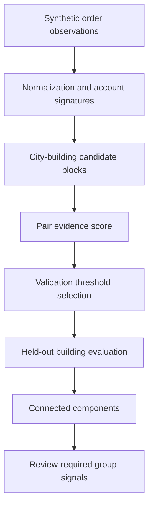

# Customer Relation Detection

[](https://github.com/parisaMSTFV/customer-relation-detection/actions/workflows/ci.yml)


A privacy-safe entity-resolution case study that links synthetic accounts through noisy shared-address evidence, selects a score threshold on validation buildings, and evaluates pair and graph recovery on held-out buildings.

## Executive summary

Multiple accounts may submit orders to the same location, but exact address matching breaks when strings contain abbreviations, Unicode digits, missing postcodes, typos, or incorrect unit numbers. This project separates candidate generation, evidence scoring, threshold selection, pair classification, and connected-component grouping.

The checked-in run generated 5,119 synthetic orders for 1,469 accounts across 180 buildings. Candidate generation recovered all known positive pairs in validation and test. A threshold of `0.86` was selected using validation buildings only. On held-out buildings, the exact-key baseline reached precision `0.995`, recall `0.657`, and F1 `0.792`. The scored resolver reached precision `0.881`, recall `0.873`, and F1 `0.877`. Connected-component ARI improved from `0.791` to `0.876`.

The improvement is not free: the scored method reduced false splits but produced 37 false-positive links, compared with 1 for the conservative baseline. Because one wrong edge can merge two groups through graph transitivity, every predicted group is marked `review_required=True`.

## Safety boundary

This repository detects shared-address signals. It does not prove family relationship, identity, residence, fraud, eligibility, ownership, or legal association. The labels `shared_household_signal`, `shared_residence_signal`, and `shared_location_review` describe evidence patterns and require analyst review.

A similar system must not be used for adverse decisions without consent, governance, bias assessment, access controls, retention limits, and an appeal process.

## Business problem

A reusable entity-resolution workflow must answer several questions before anyone acts on its output:

- Does the blocking rule retain true related pairs, or are they lost before scoring?
- How much recall does fuzzy, missing-aware evidence recover over exact matching?
- What precision is sacrificed at the selected threshold?
- Do pair-level improvements remain improvements after graph connected components are formed?
- Which address-noise conditions still create false splits or false merges?

## Workflow



## Synthetic data and split design

The generator creates 180 fictional buildings with four units each. Each unit contains one or more synthetic accounts and has a planted relation-group identifier stored in a separate ground-truth table. Repeated order observations contain fictional city, street, building, unit, postcode, and family-token fields.

Address noise is assigned at the account level:

- `clean`: consistent address representation;
- `moderate`: abbreviations, punctuation, casing, spacing, and Unicode digits;
- `heavy`: street typos, missing postcodes, missing units, or shifted unit numbers.

A whole building belongs to exactly one split. Accounts and orders from the same building can never appear in both validation and test. Ground-truth group labels and split labels are absent from the observations passed to normalization and scoring. See [data provenance](DATA_PROVENANCE.md).

## Methodology

### Normalization

The pipeline normalizes Unicode, Persian and Arabic digits, casing, punctuation, spacing, and common address abbreviations. Repeated orders are collapsed to one modal signature per account.

### Candidate generation

Pairs are generated only inside a normalized city-building block. This step controls computational cost, but it can make later recall impossible if the block is too strict. Candidate recall is therefore measured against every planted positive pair before model metrics are calculated.

### Exact-key baseline

The baseline predicts a link only when normalized city, street, building, unit, and postcode keys are identical. It is intentionally conservative and provides a meaningful reference for the scored method.

### Missing-aware relation score

The score combines city agreement, fuzzy street similarity, building agreement, unit agreement, postcode agreement, and a low-weight synthetic family-token signal. Missing postcode evidence is removed from the available-evidence denominator. Missing unit evidence is treated as disagreement because unit is required to distinguish neighboring accounts in the same building.

Family-token agreement receives only 2% weight. It can support another address signal, but it cannot establish a relationship by itself.

### Threshold selection

Thresholds from `0.65` to `0.95` are evaluated on validation buildings. The method selects the highest-precision threshold among F1 ties. The chosen threshold is frozen before test buildings are evaluated.

### Graph groups

Predicted positive pairs become edges in an undirected account graph. Connected components form candidate groups, including singleton accounts. Pairwise F1 evaluates links; ARI evaluates the final component partition. Both are required because one false edge can merge multiple otherwise correct accounts.

## Executed results

| Test metric | Exact-key baseline | Scored resolution |
|---|---:|---:|
| Precision | 0.995 | 0.881 |
| Recall | 0.657 | 0.873 |
| F1 | 0.792 | 0.877 |
| True positives | 207 | 275 |
| False positives | 1 | 37 |
| False negatives | 108 | 40 |
| Cluster ARI | 0.791 | 0.876 |

Additional checks:

| Check | Result |
|---|---:|
| Validation candidate recall | 100% |
| Test candidate recall | 100% |
| Selected validation threshold | 0.86 |
| Schema and separation checks | 9 passed |
| Core artifact fingerprint | `f65736b3d447648b` |


The scored resolver trades some precision for substantially higher recall. Whether that trade-off is acceptable depends on the cost of review, false merges, and false splits; the synthetic F1 optimum is not a universal business threshold.

## Threshold and error analysis


Only validation data appears in this curve. Test metrics were calculated after `0.86` was selected.


Both methods recovered all clean and moderate positive pairs in the test fixture. Under heavy noise, exact-key recall fell to `0.000`, while scored resolution recovered `0.630`. The remaining gap shows that fuzzy evidence does not solve missing or incorrect unit information reliably.

## Review artifact


Node color represents a predicted connected component and edge width represents relation score. The visualization intentionally makes no claim about the relationship type.

`reports/review_groups.csv` provides group size, a descriptive signal label, dominant synthetic family-token share, minimum and mean link scores, and the mandatory review flag.

## Repository structure

```text
customer-relation-detection/
├── configs/analysis.json
├── data/
│   ├── README.md
│   ├── synthetic_orders.csv
│   └── synthetic_ground_truth.csv
├── docs/interview_guide.md
├── reports/
│   ├── figures/
│   ├── metrics.json
│   ├── threshold_curve.csv
│   ├── test_pair_predictions.csv
│   ├── predicted_group_assignments.csv
│   └── review_groups.csv
├── scripts/check_sensitive.py
├── src/customer_relation_detection/
├── tests/
└── .github/workflows/ci.yml
```

## Reproduce the project

Python 3.11 or 3.12 is required.

```bash
python -m venv .venv
source .venv/bin/activate
python -m pip install -e ".[dev]"
make reproduce
make check
```

Windows PowerShell activation:

```powershell
.venv\Scripts\Activate.ps1
```

`relation-detection smoke` runs the full pipeline in a temporary directory without changing checked-in artifacts.

## Tests and quality checks

The test suite covers deterministic generation, ground-truth isolation, building-level split integrity, Unicode and abbreviation normalization, candidate recall, pair-feature ordering, validation-only threshold selection, noise breakdowns, singleton-aware components, required artifacts, and deterministic fingerprints.

GitHub Actions runs Ruff, format checks, Pytest on Python 3.11 and 3.12, the sensitive-content scan, and the complete smoke pipeline without credentials, connectors, or external data.

## Limitations

- All locations and relations are synthetic; real address distributions and error processes will differ.
- Candidate blocking is unusually strong in this fixture and reached 100% recall; production blocking requires separate monitoring.
- Score weights are designed rules rather than coefficients fitted on representative labeled data.
- Validation and test cover one synthetic generator and one seed.
- A pairwise threshold does not explicitly optimize connected-component errors.
- The score does not model temporal residence changes, delivery intermediaries, offices, or shared pickup points.
- The synthetic family token is a weak proxy and must never be treated as proof of family relation.
- No fraud, abuse, eligibility, marketing uplift, or business-value claim is evaluated.

## Potential next steps

A governed extension would add time-aware address histories, probabilistic linkage, threshold selection with explicit false-merge cost, calibrated review queues, protected-attribute testing, and monitoring for drift. Production use would also require strict purpose limitation, access control, retention policy, and human appeal.

## Portfolio distinction

This repository demonstrates entity resolution, candidate generation, validation splits, pair classification, and graph transitivity risk. The community-detection repository instead discovers affinity topology in a user-category network; the two projects answer different questions and use different evaluation frameworks.

## Author

Parisa Mostafavi · [LinkedIn](https://www.linkedin.com/in/parisa-mostafavi/)
