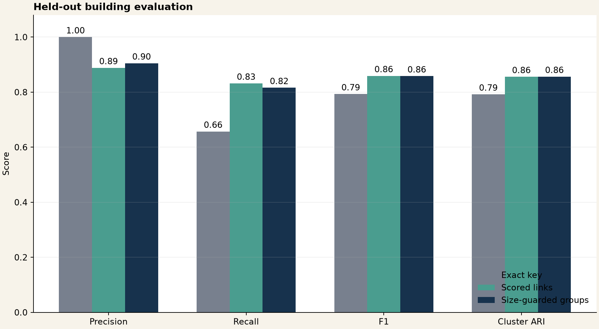
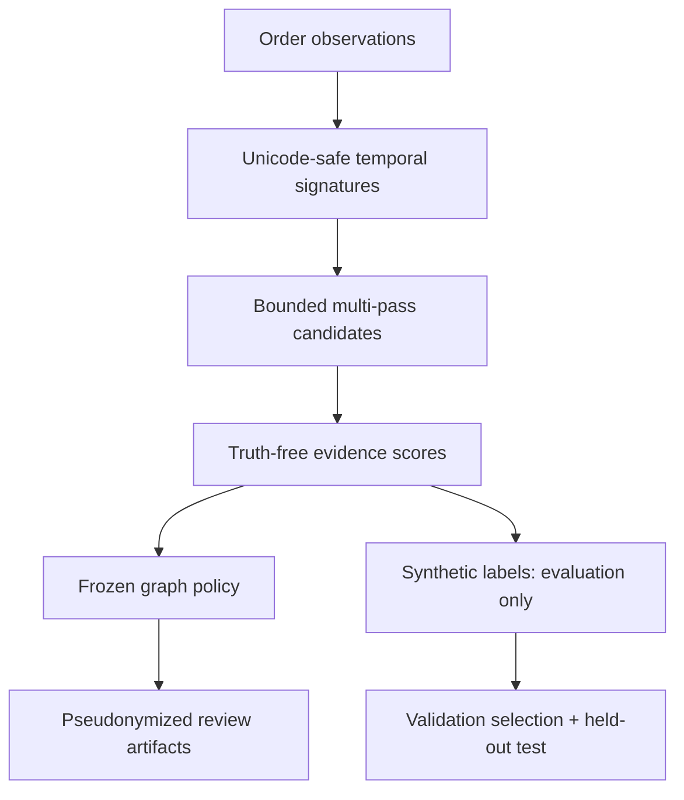
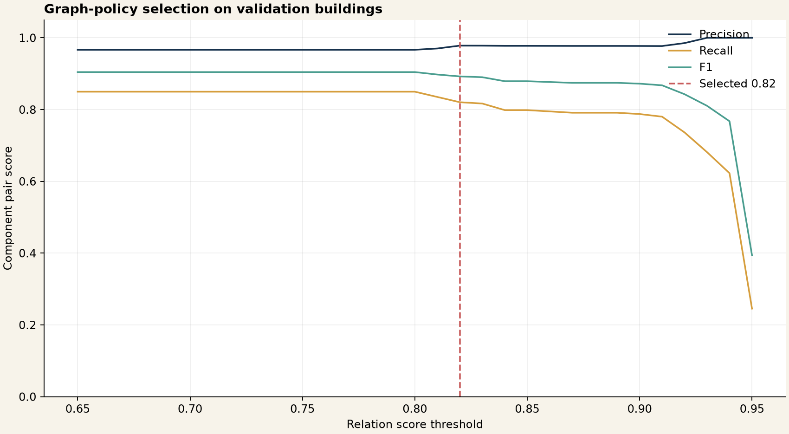
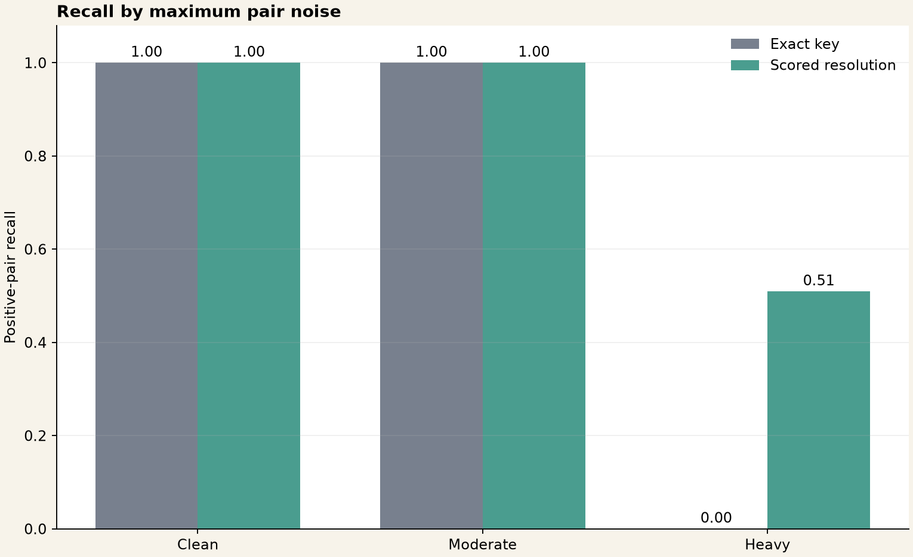
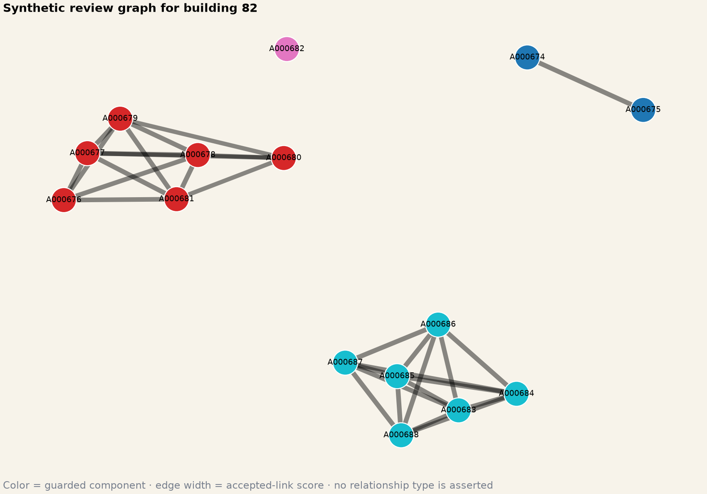

# Customer Relation Detection

[](https://github.com/parisaMSTFV/customer-relation-detection/actions/workflows/ci.yml)


One false link can join two otherwise separate customer groups through graph transitivity. This project makes that failure mode measurable and reviewable: it normalizes multilingual address observations, generates bounded candidates, scores evidence without loading truth, selects a graph policy on validation buildings, and evaluates the frozen decision on held-out buildings.

| Held-out metric | Exact key | Scored links | Guarded groups |
|---|---:|---:|---:|
| Pair precision | **1.000** | 0.888 | 0.905 |
| Pair recall | 0.657 | **0.832** | 0.816 |
| Pair F1 | 0.793 | **0.859** | 0.858 |
| Component-pair F1 | 0.793 | 0.857 | **0.857** |
| Component ARI | 0.792 | 0.856 | **0.856** |
| B-cubed F1 | 0.901 | **0.927** | 0.927 |

The selected validation policy uses threshold `0.82` and a six-account component cap. On test buildings, the cap reduced component false merges from 36 to 29 and increased false splits from 52 to 57. It is a transparent safety trade-off, not a universal household-size assumption.



## Safety boundary

The output is a shared-address review signal. It does not prove family relationship, identity, residence, fraud, eligibility, ownership, or legal association. Every predicted group requires human review. A comparable system must not support adverse decisions without a separately approved purpose, consent or other lawful basis, access control, retention limits, bias assessment, monitoring, and an appeal process.

This repository contains only generated observations. The operational CLI does not export raw address fields or raw account IDs.

## What changed in the hardened design

- Packaged configuration is included inside the wheel; CI builds and smoke-tests a non-editable wheel.
- Normalization preserves Unicode letters, canonicalizes Persian/Arabic character variants and digits, and parses building and unit numbers with field-specific keywords.
- An account signature is one address tuple that was actually observed. A snapshot date and per-account history window prevent future observations and stale addresses from being mixed.
- Candidate generation combines `city_building`, `postcode`, and `city_street` passes, deduplicates pairs, and defers oversized blocks before quadratic enumeration.
- City and building agreement remain diagnostic features but are excluded from the weighted score because they often define the candidate block.
- `build_pair_features` has no truth argument. Synthetic labels are attached only through a separate evaluation function.
- Threshold and component cap are selected together using component outcomes, a validation precision floor, and explicit 5:1 false-merge versus false-split cost.
- Evaluation includes pair metrics, component-pair merge/split errors, ARI, B-cubed metrics, subgroup errors by noise severity, block recall, and guardrail audits.
- The operational path uses a versioned frozen policy and pseudonymizes account identifiers with HMAC-SHA256.

## Workflow



## Synthetic benchmark

The checked-in run contains 5,119 generated orders, 1,469 accounts, 720 true groups, and 180 buildings. Whole buildings are assigned to train, validation, or test. Truth, split, relation type, and noise labels never enter normalization or scoring.

Candidate generation recovered 100% of planted positive pairs in validation and test and produced 5,805 unique candidate pairs. That perfect recall belongs only to this generator; production block recall must be measured on representative labeled samples.

### Normalization and temporal signatures

The normalizer applies Unicode NFKC, Persian/Arabic digit conversion, canonical Persian characters such as `ي → ی` and `ك → ک`, case folding, punctuation removal, and common English address abbreviations. It preserves non-Latin letters.

Repeated orders are reduced to one complete observed address tuple per account. Selection uses tuple frequency, then recency, then a stable tie-break. The default history window is 365 days relative to each account's latest eligible observation. `--snapshot-date` excludes later observations.

### Candidate generation and block control

Candidates are the union of three passes:

- normalized city plus building;
- normalized postcode;
- normalized city plus street.

Pairs found by several passes are emitted once with their evidence sources. Blocks above `max_block_size=250` are not enumerated; their hashed key, size, strategy, and `deferred_oversized` decision are written to `candidate_block_audit.csv`.

### Missing-aware score

The score uses street similarity (45%), unit agreement (35%), postcode agreement (15%), and the low-weight generated family token (5%). Missing optional postcode or family-token evidence is removed from the denominator. Missing unit evidence remains disagreement because unit information separates neighboring accounts. The family token can support address evidence but cannot establish a relationship.

### Component-aware policy selection

Each threshold from `0.65` through `0.95` is evaluated with component caps of 4, 5, 6, 8, and 10 on validation buildings. Policies must meet a component-pair precision floor of 0.90. Eligible policies minimize:

\[
5 \times \text{false merges} + 1 \times \text{false splits}
\]

The selected validation policy reached component precision `0.978`, component recall `0.821`, and weighted error cost `74`. Threshold `0.82` and cap `6` were frozen before test evaluation. Test component precision was `0.899`, which demonstrates that a validation floor is not a production guarantee.

### Held-out results

| Test metric | Exact key | Scored links | Guarded groups |
|---|---:|---:|---:|
| True-positive edges | 207 | 262 | 257 |
| False-positive edges | 0 | 33 | 27 |
| False-negative edges | 108 | 53 | 58 |
| Component false merges | 0 | 36 | 29 |
| Component false splits | 108 | 52 | 57 |
| B-cubed precision | 1.000 | 0.943 | 0.949 |
| B-cubed recall | 0.819 | 0.912 | 0.907 |

The guardrail deferred 11 edges across the full fixture and reduced the largest component from seven to six accounts. Deferred edges remain review candidates; they are not converted into negative evidence.

### Fixed-policy seed stability

The frozen threshold and cap were also evaluated—without re-selection—on five additional generated fixtures of 60 buildings each (`1`, `7`, `42`, `99`, `123`). Results are stored in `reports/policy_stability.csv`.

| Guarded metric across seeds | Mean | Std. dev. | Min | Max |
|---|---:|---:|---:|---:|
| Pair precision | 0.948 | 0.031 | 0.901 | 0.989 |
| Pair recall | 0.799 | 0.088 | 0.676 | 0.935 |
| Pair F1 | 0.866 | 0.061 | 0.772 | 0.961 |
| Component-pair F1 | 0.866 | 0.060 | 0.779 | 0.961 |
| B-cubed F1 | 0.938 | 0.026 | 0.896 | 0.976 |

The recall range is material. Multi-seed evaluation reduces dependence on one draw but does not replace external validation or uncertainty estimates from representative real data.







## Run the benchmark

Python 3.11 or 3.12 and [uv](https://docs.astral.sh/uv/) are required.

```bash
uv sync --locked --all-extras --dev
make check
make reproduce
make wheel-smoke
```

`make wheel-smoke` builds a wheel and runs the complete smoke command in an isolated, non-editable environment.

## Analyze an unlabeled CSV

The CSV contract is documented in [`docs/input_contract.md`](docs/input_contract.md). Set an application-specific secret salt; do not put it in source control or shell history.

```bash
export RELATION_ID_SALT='replace-with-a-secret-value'
uv run relation-detection analyze \
  --input path/to/orders.csv \
  --output-root path/to/review-output \
  --snapshot-date 2026-08-24
```

The command uses the frozen `relation-policy-v2` threshold and cap. It writes only:

- pseudonymized group assignments;
- pseudonymized accepted/deferred edge audits;
- aggregate review-group profiles;
- hashed block audits;
- policy, privacy, retention, and run metadata.

It does not copy the input, normalized signatures, raw addresses, raw identifiers, or truth labels to the output directory.

## Repository structure

```text
customer-relation-detection/
├── configs/analysis.json
├── data/
├── docs/
│   ├── input_contract.md
│   └── interview_guide.md
├── reports/
│   ├── figures/
│   ├── candidate_block_audit.csv
│   ├── component_policy_curve.csv
│   ├── policy_stability.csv
│   ├── subgroup_errors.csv
│   └── metrics.json
├── scripts/check_sensitive.py
├── src/customer_relation_detection/
├── tests/
├── uv.lock
└── .github/workflows/ci.yml
```

## Quality and security checks

GitHub Actions uses the locked environment on Python 3.11 and 3.12. It runs Ruff lint and formatting checks, Pytest with a 90% coverage gate, a sensitive-content scan over tracked and non-ignored files, and an isolated wheel smoke test. The pipeline needs no network, credential, connector, or production data.

## Limitations

- All addresses, accounts, orders, and labels are generated; no real-world performance claim is made.
- The main held-out benchmark uses one seed; a five-seed generated stress check is included, but it still uses the same generator. Representative external validation remains required.
- Rule weights are designed, not fitted or calibrated on representative labeled observations.
- The generated `noise_level` groups are error conditions, not protected demographic groups; real subgroup and fairness evaluation is still required.
- The temporal signature chooses one recent address and does not model simultaneous legitimate locations, delivery intermediaries, offices, pickup points, or uncertain move dates.
- Oversized blocks are deferred, so an operational review process must resolve them and monitor their rate.
- A precision floor selected on validation data can fail on new data, as the held-out result illustrates.
- HMAC pseudonymization is not anonymization. Linkable artifacts still need purpose limitation, restricted access, and deletion.
- No fraud, abuse, eligibility, marketing uplift, or business-value claim is evaluated.

## Author

Parisa Mostafavi · [LinkedIn](https://www.linkedin.com/in/parisa-mostafavi/)
